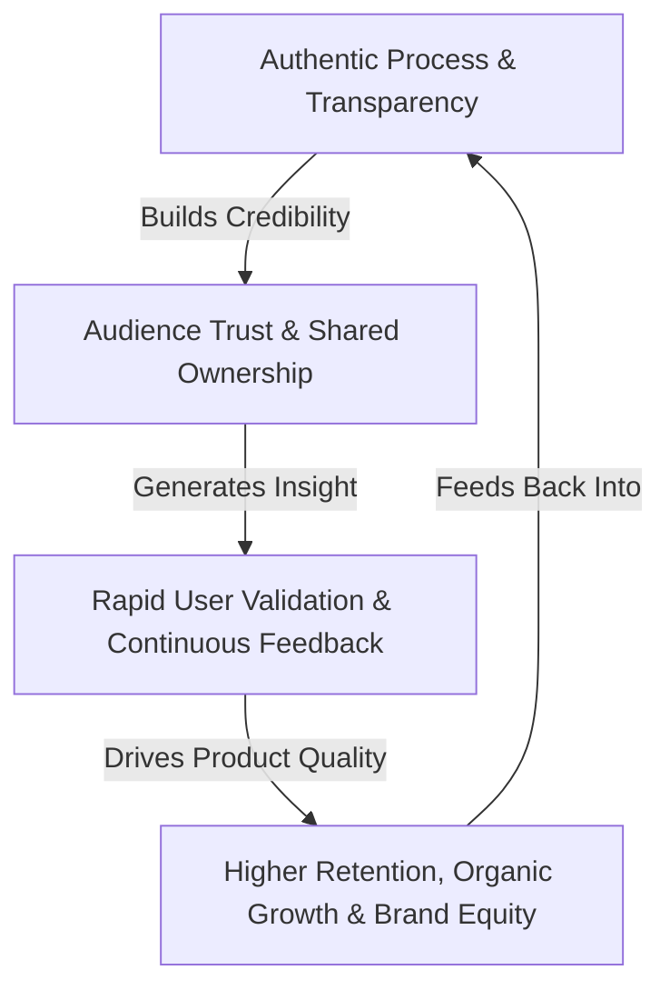

# 🚀 Build in Public & Indie Hacker Master Knowledge Hub

[](https://theinpublic.com)
[](https://theinpublic.com)
[](./LICENSE)

> **A comprehensive, first-principles collection of strategic engineering guides, operational roadmaps, content frameworks, financial transparency models, open-source strategies, and Indie Hacker playbooks. Live portal: [theinpublic.com](https://theinpublic.com).**

---

## 🏷️ Repository Tags & Topics

`#buildinpublic` `#indiehacker` `#saas` `#bootstrapping` `#mvp` `#open-startup` `#startup-roadmap` `#developer-to-founder` `#lessons` `#micro-saas` `#product-market-fit` `#pricing-strategy` `#retention` `#unit-economics` `#growth-loops` `#onboarding` `#b2b-saas` `#programmatic-seo` `#ai-saas` `#micro-acquisition` `#legal-compliance` `#cli-cheatsheet` `#theinpublic`

---

## 📌 Executive Overview & Value Flywheel

**Building in Public (BiP)** and **Indie Hacking** are modern paradigms redefining software entrepreneurship. Rather than developing in isolation or chasing Venture Capital valuations, independent creators build transparently, validate early with real users, focus on immediate cash flow, and cultivate long-term personal freedom. Live community hub and resources: [theinpublic.com](https://theinpublic.com).



---

## 🏆 Famous Open Startups Directory

Learn from pioneer companies operating with total financial and operational transparency:

| Startup | Category | Revenue / ARR | Tech Stack | Live Dashboard |
| :--- | :--- | :--- | :--- | :--- |
| **[Buffer](https://buffer.com)** | Social Media Management | ~$20M ARR | React, Node.js, Kubernetes | [buffer.com/open](https://buffer.com/open) |
| **[Nomad List](https://nomadlist.com)** | Global Remote Work Portal | ~$3M ARR | Vanilla JS, PHP, SQLite | [nomadlist.com/open](https://nomadlist.com/open) |
| **[Plausible Analytics](https://plausible.io)** | Privacy-First Web Analytics | ~$2.5M ARR | Elixir, Phoenix, ClickHouse | [plausible.io/open](https://plausible.io/open) |
| **[PostHog](https://posthog.com)** | Product Analytics & Telemetry | ~$10M ARR | Python, Django, React | [posthog.com/handbook](https://posthog.com/handbook) |
| **[Ghost](https://ghost.org)** | Open Source Publishing | ~$6M ARR | Node.js, Ember.js, MySQL | [ghost.org/about](https://ghost.org/about) |
| **[Cal.com](https://cal.com)** | Open Source Scheduling | ~$2M ARR | Next.js, TypeScript, PostgreSQL | [cal.com/open](https://cal.com/open) |
| **[Dub.co](https://dub.co)** | Open Source Link Management | ~$500k ARR | Next.js, Redis, Upstash | [dub.co/open](https://dub.co/open) |

---

## 📚 Master Knowledge Modules (26 Modules)

This repository is structured into **26 core minimalist modules**, covering every single aspect of independent software creation:

| Module | Core Topic & Focus Area | Target Audience | Primary Outcome |
| :--- | :--- | :--- | :--- |
| 📜 [**`lessons`**](./lessons/README.md) | **What Building Kitwork Has Taught Me** | Independent Builders & Founders | 18 lessons on simplicity, Go runtime engineering, family, and building from Tam Kỳ. |
| 🚀 [**`build-in-public`**](./build-in-public/README.md) | **From Startup Journey to Community Engine** | All Builders & Founders | Establish authentic mindset, trust flywheel, distribution channels & safety guardrails. |
| ⚡️ [**`mvp`**](./mvp/README.md) | **First-Principles MVP Validation Guide** | Engineers & Product Managers | Isolate core pain points, eliminate feature creep, and ship testable MVPs in days. |
| 🗺️ [**`roadmap`**](./roadmap/README.md) | **The Complete 6-Phase #buildinpublic Roadmap** | Indie Hackers & Creators | End-to-end operational blueprint from preparation to post-launch monetization. |
| 💻 [**`coder-to-founder`**](./coder-to-founder/README.md) | **Developer to Startup Founder Transition** | Software Engineers & Coders | Pivot from writing code to building business operations, financial models & PMF. |
| 🛠️ [**`indie-hacker`**](./indie-hacker/README.md) | **The Indie Hacker Guide** | Solo Founders & Bootstrappers | Master self-funded bootstrapping, solo founder tech stacks, and ramen profitability. |
| ⚖️ [**`bootstrapping`**](./bootstrapping/README.md) | **Bootstrapping vs Venture Capital** | Tech Entrepreneurs | Tradeoff analysis between equity retention/cash flow vs VC hypergrowth & microservice scaling. |
| 💡 [**`micro-saas`**](./micro-saas/README.md) | **The Micro-SaaS Playbook** | 1-Person SaaS Developers | Find niche software ideas, structure subscription pricing ($9-$99/mo), and automate support. |
| 🏢 [**`b2b-vs-b2c-saas`**](./b2b-vs-b2c-saas/README.md) | **B2B vs B2C SaaS Economics** | Solo SaaS Builders | Tradeoff analysis showing why B2B Micro-SaaS yields higher ARPU, lower churn & solo fit. |
| 🔍 [**`zero-to-one`**](./zero-to-one/README.md) | **Ideation & Problem Discovery** | Early Stage Founders | Identify hair-on-fire problems, master The Mom Test interviews, and run smoke tests. |
| 🎯 [**`product-market-fit`**](./product-market-fit/README.md) | **Product-Market Fit (PMF) Guide** | Product Builders | Measure PMF with Sean Ellis 40% rule, retention curve flattening, and avoid fake PMF. |
| 📈 [**`unit-economics`**](./unit-economics/README.md) | **Unit Economics (CAC, LTV, Margin)** | Financial Builders | Calculate LTV/CAC ratios (target 3x+), CAC payback periods (<6-12 mos), and Rule of 40. |
| 💳 [**`pricing-strategies`**](./pricing-strategies/README.md) | **SaaS & Product Pricing Strategies** | Indie Creators & Founders | Master value-based pricing, tiered plans, usage models, LTDs, and price optimization. |
| 🪣 [**`retention-and-churn`**](./retention-and-churn/README.md) | **User Retention & Churn Reduction** | SaaS Builders | Seal leaky buckets, diagnose voluntary vs involuntary churn, and build dunning loops. |
| ⚡️ [**`customer-onboarding`**](./customer-onboarding/README.md) | **Customer Onboarding & TTV** | Product Designers | Reduce Time-to-Value (TTV < 2 mins), engineer "Aha!" moments, and clear empty states. |
| 🔄 [**`growth-loops`**](./growth-loops/README.md) | **Growth Loops & Viral Distribution** | Growth Engineers | Build compounding viral, content & PLG loops replacing linear marketing funnels. |
| 🔍 [**`marketing-and-seo`**](./marketing-and-seo/README.md) | **Programmatic SEO & Organic Growth** | SaaS Marketers | Build pSEO engines, capture long-tail keywords, and set up founder marketing channels. |
| 🤖 [**`ai-native-saas`**](./ai-native-saas/README.md) | **Building AI-Native Micro-SaaS** | AI Developers | Architect RAG context pipelines, optimize token costs, and secure against prompt injections. |
| ⚡️ [**`cheatsheet`**](./cheatsheet/README.md) | **Indie Hacker CLI & Commands Reference** | Command-Line Developers | Stripe CLI webhooks, Vercel/Supabase deployments, Docker VPS commands & Git workflows. |
| ⚖️ [**`legal-and-compliance`**](./legal-and-compliance/README.md) | **Legal, Tax & Compliance Framework** | Global Indie Founders | Delaware incorporation (LLC vs C-Corp), Merchant of Record (Paddle/Stripe), VAT & GDPR. |
| 🏛️ [**`exit-and-acquisition`**](./exit-and-acquisition/README.md) | **Micro-Acquisitions & Exiting** | SaaS Sellers & Exiting Founders | Value SaaS businesses (SDE/ARR multiples), list on Acquire.com, and complete asset transfers. |
| 📊 [**`open-metrics`**](./open-metrics/README.md) | **Financial Transparency & Revenue Metrics** | Bootstrapped Startups | Setup live MRR/ARR dashboards, calculate unit economics (CAC/LTV), and build `/open` pages. |
| 🎯 [**`launch`**](./launch/README.md) | **Product Launch & Distribution Playbook** | Launching Makers | 14-day pre-launch plan, Product Hunt Maker formulas, Show HN rules & Reddit execution. |
| 👥 [**`audience`**](./audience/README.md) | **Audience-First Product Development** | Indie Makers & Creators | Convert social followers into active co-builders, master founder storytelling & waitlist funnels. |
| 📝 [**`content`**](./content/README.md) | **Content Calendar & Publishing Framework** | Content-driven Founders | Engineering-to-content matrix, high-converting post templates & cross-posting workflows. |
| 🔓 [**`open-source`**](./open-source/README.md) | **Open Source Strategy & Commercialization** | Open Source Developers | Select software licenses (MIT/AGPL), build GitHub communities, and implement Open Core SaaS models. |

---

## 🗺️ Recommended Execution Path

Follow this interactive Mermaid roadmap to navigate the knowledge base based on your project stage:


---

## ⚡️ Indie Hacker Quick CLI Reference

```bash
# Stripe CLI: Test webhooks locally
stripe listen --forward-to localhost:8080/api/webhooks
stripe trigger customer.subscription.created

# Vercel: Production deployment
npx vercel --prod

# Supabase: Start local DB & sync migrations
npx supabase start
npx supabase db push

# Docker: Run production containers
docker compose up -d --build
```

---

## 🧰 Recommended Tools & Ecosystem

### Analytics & Financial Dashboards
- **[Baremetrics](https://baremetrics.com)** / **[ChartMogul](https://chartmogul.com)**: Automatic open revenue dashboards connected to Stripe/Paddle.
- **[Plausible Analytics](https://plausible.io)** / **[Umami](https://umami.is)**: Lightweight, privacy-first web analytics with public link sharing.

### Public Feedback & Roadmaps
- **[Canny](https://canny.io)** / **[FeatureOS](https://featureos.app)**: Public feature request voting and product roadmap boards.

### Maker Communities & Portals
- **[theinpublic.com](https://theinpublic.com)**: Live portal & community hub for makers and builders.
- **[Indie Hackers](https://indiehackers.com)**: Global bootstrapped founder community.
- **[WIP.co](https://wip.co)**: Real-time maker shipping & accountability platform.
- **[Product Hunt Discussions](https://producthunt.com/discussions)**: Pre-launch discussion forum for product makers.

---

## 📜 License & Open Contributions

This knowledge hub is open source under the [MIT License](./LICENSE). Contributions, improvements, and real-world case study additions are welcome via Pull Requests. Please see our [CONTRIBUTING.md](./CONTRIBUTING.md) and [CODE_OF_CONDUCT.md](./CODE_OF_CONDUCT.md).

---

*Maintained and powered by [theinpublic.com](https://theinpublic.com).*
