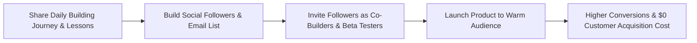

# Audience-First Product Development: Building a Maker & Developer Community

> **A first-principles guide to building an engaged audience, mastering founder storytelling, and converting social followers into active product co-builders.**

---

## 📌 Executive Summary

Traditional product development builds software in isolation and searches for customers post-launch. **Audience-First Development** flips this model: you cultivate a community around a shared problem domain *while* building the solution. When launch day arrives, you are not shouting into the void—you are launching to a warm, supportive audience.



---

## 1. The Audience-First Paradigm Shift

Traditional product development builds a product first and searches for an audience second. **Audience-First Development** flips this model: you cultivate an audience around a problem domain *while* you build the solution.

```text
[ Traditional Model ]   ──► Build Product ──► Launch ──► Search for Customers (High Risk)
[ Audience-First Model] ──► Share Journey ──► Build Audience ──► Launch to Eager Fans (Low Risk)
```

---

## 2. The 4 Pillars of Developer & Founder Storytelling

### Pillar 1: Vulnerability & Authenticity
Audiences do not connect with polished corporate press releases—they connect with human struggle. Sharing real technical challenges, failed experiments, and raw revenue figures builds deep empathy and trust.

### Pillar 2: Process as Content
Every engineering task can be transformed into compelling content:
- Debugging a complex race condition $\rightarrow$ **Technical Deep Dive Thread**.
- Redesigning a clunky UI modal $\rightarrow$ **Before vs After Visual Post**.
- Deciding between Postgres vs SQLite $\rightarrow$ **Architecture Comparison Post**.

### Pillar 3: Value-First Insight
Every post must answer the reader's implicit question: *"What do I learn from this?"* Avoid vanity announcements; distill every win or loss into an actionable takeaway.

### Pillar 4: Interactive Co-Creation
Involve your audience directly in product design:
- Host polls on feature prioritization.
- Share raw Figma prototypes for UI feedback.
- Release early beta access tokens exclusively to active commenters.

---

## 4. Platform-Specific Audience Strategies

| Platform | Core Format | Winning Strategy | Key Metric |
| :--- | :--- | :--- | :--- |
| **X (Twitter)** | Micro-threads, screenshots, short code snippets | Post daily micro-updates. Engage heavily in replies under peer builders' posts. | Engagement Rate & Retweets |
| **LinkedIn** | Long-form narratives, lessons learned, B2B reflections | Focus on professional growth, founder lessons, and business strategy. | Comments & DMs |
| **Substack / Newsletter** | Weekly deep dives, monthly transparency reports | Offer exclusive early access, detailed financial retrospectives, and deep technical post-mortems. | Subscriber Open Rate (>45%) |
| **YouTube / Loom** | Live coding streams, screen recordings, product demos | Record raw 5-minute Loom walkthroughs showing new features under development. | Watch Time & Conversion |

---

## 5. Converting Followers into Active Beta Users

```text
┌───────────────────────────────────────────────────────────────────────────┐
│                      THE AUDIENCE CONVERSION FUNNEL                       │
└───────────────────────────────────────────────────────────────────────────┘
   Social Followers (Top of Funnel)
         │
         ▼
   Email Newsletter / Waitlist (Warm Leads)
         │
         ▼
   Private Beta Testers (Active Co-Builders)
         │
         ▼
   Paying Customers & Brand Evangelists (Bottom of Funnel)
```

### The Waitlist Conversion Playbook
1. **The Teaser**: Share a 15-second video recording of your core feature solving a painful problem.
2. **The Call to Action (CTA)**: Drop a simple landing page link with a clear value proposition: *"Join 250+ builders getting early access."*
3. **The Onboarding Sequence**: Send a personalized welcome email asking: *"What is the #1 problem you hope this tool solves for you?"*

---

## 6. Summary

Building an audience before or alongside your product is the ultimate insurance policy for independent creators. When launch day arrives, you aren't shouting into the void—you are opening the doors to a community that helped build the product with you.
