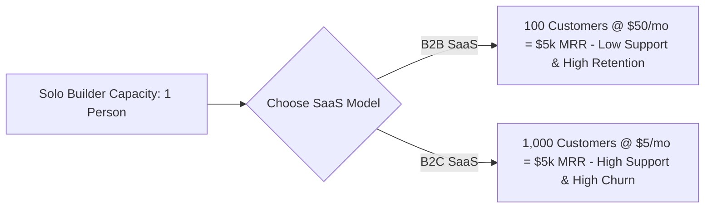

# B2B vs. B2C SaaS for Solo Founders: Economics & Tradeoffs

> **A first-principles comparative analysis between Business-to-Business (B2B) and Business-to-Consumer (B2C) software models for solo builders and indie hackers.**

---

## 📌 Executive Summary

For solo developers, choosing between B2B (Business-to-Business) and B2C (Business-to-Consumer) is the most critical strategic decision. B2B SaaS operates on high Average Revenue Per User (ARPU), rational ROI purchasing, and low churn. B2C SaaS requires millions of top-of-funnel visitors to survive low pricing ($5/mo) and high consumer churn. For 1-person teams, B2B Micro-SaaS represents the most sustainable path to financial independence.



---

## 1. Comparative Analysis Matrix

| Dimension | B2B SaaS (Business-to-Business) | B2C SaaS (Business-to-Consumer) |
| :--- | :--- | :--- |
| **Willingness to Pay** | High ($29 to $499+/month) | Low ($2 to $15/month) |
| **Value Perception** | Solves business friction / saves labor cost | Personal entertainment, casual utility |
| **Customer Support Burden** | Low-to-Moderate (Fewer users, higher ARPU) | Very High (Volume of low-value support tickets) |
| **Monthly Churn Rate** | Low (1% to 3% monthly) | High (5% to 15%+ monthly) |
| **Sales Conversion** | Rational, ROI-driven decision | Emotional, impulse-driven decision |
| **Solo Founder Fit** | ⭐⭐⭐⭐⭐ **High Fit** | ⭐⭐☆☆☆ **Difficult Fit** |

---

## 2. The Math of $5,000 MRR: B2B vs. B2C

```text
┌───────────────────────────────────────────────────────────────────────────┐
│                    THE $5,000 MRR CUSTOMER COUNT MATH                     │
└───────────────────────────────────────────────────────────────────────────┘
   B2B SaaS ($50/mo ARPU)   ──► Needs ONLY 100 Paying Customers
   B2C SaaS ($5/mo ARPU)    ──► Needs 1,000 Paying Customers
   Consumer Free Tier (1%)  ──► Requires 100,000 Total Signups & Server Load!
```

### Milestone Comparison Table

| Target MRR Goal | B2B @ $49/mo ARPU | B2B @ $99/mo ARPU | B2C @ $5/mo ARPU | B2C @ $9/mo ARPU |
| :--- | :--- | :--- | :--- | :--- |
| **$1,000 MRR** | 20 Customers | 10 Customers | 200 Customers | 111 Customers |
| **$5,000 MRR** | **102 Customers** | **51 Customers** | 1,000 Customers | 555 Customers |
| **$10,000 MRR** | **204 Customers** | **101 Customers** | 2,000 Customers | 1,111 Customers |

---

## 3. Why B2B SaaS is Superior for Solo Builders

1. **Rational ROI Buying Decisions**: Businesses buy software using company expense cards if the tool saves $500 in employee labor or prevents costly outages. Charging $49/mo is a simple math calculation for a business manager.
2. **High Switching Costs**: Once a B2B SaaS integrates into daily company workflows or database systems, switching tools is inconvenient, leading to sub-3% monthly churn.
3. **Manageable Support Load**: Handling support tickets for 100 business users takes a few hours a week. Handling support for 2,000 consumer users requires full-time support staff.

---

## 4. The "Prosumer" Bridge: B2C Strategy That Works

If you choose to target consumers, target **Prosumers**—freelancers, YouTubers, podcasters, agency owners, and independent creators who spend personal funds for professional outcomes.

```text
Pure Consumer ($3/mo Photo Filter) ──► Low ARPU, High Churn (Avoid)
Prosumer ($29/mo Video Transcriber) ──► High ARPU, Low Churn (Acceptable)
```

---

## 5. Summary

For solo software engineers seeking financial independence, B2B Micro-SaaS represents the most reliable path. High ARPU, rational ROI buying decisions, and low churn allow solo builders to reach sustainable revenue with a small, manageable customer base.

