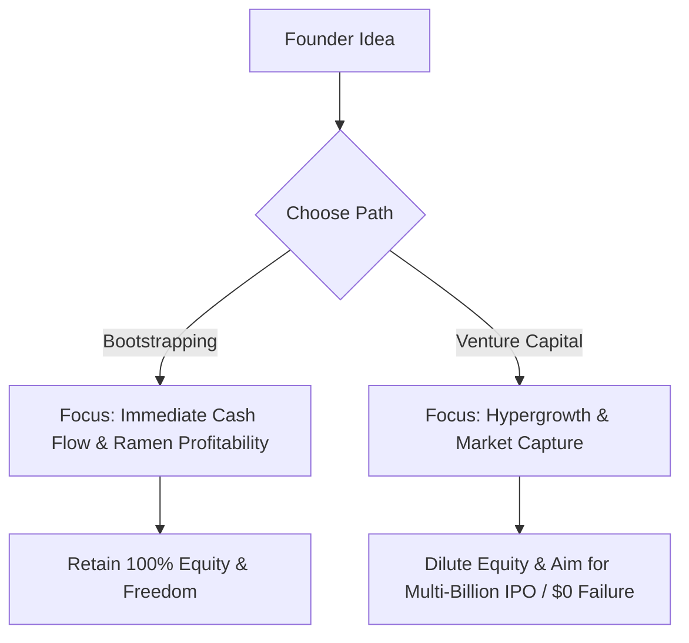
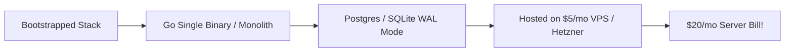

# Bootstrapping vs. Venture Capital: Strategic & Architectural Tradeoffs

> **A first-principles comparative guide helping founders choose between self-funded bootstrapping and institutional Venture Capital (VC) funding.**

---

## 📌 Executive Summary

Bootstrapping means funding software growth through customer subscription revenue rather than selling equity to venture capitalists. Neither model is universally better—they serve fundamentally different business types. For solo developers building digital SaaS, bootstrapping delivers equity retention, complete creative freedom, and sustainable cash flow without board oversight.



---

## 1. Comparative Analysis Matrix

| Dimension | Bootstrapping (Indie Route) | Venture Capital (VC Route) |
| :--- | :--- | :--- |
| **Funding Source** | Personal savings & customer subscription revenue | Angel investors, VCs, institutional funds |
| **Equity Ownership** | Founder retains **80%–100% equity** | Diluted to 10%–20% across Seed, Series A/B rounds |
| **Success Benchmark** | **Ramen Profitability**, cash flow & lifestyle freedom | Multi-billion dollar valuation, IPO, or massive M&A |
| **Growth Velocity** | Steady, organic, cash-flow constrained | Hypergrowth, aggressive customer acquisition spend |
| **Failure Rate** | Low financial risk (Exit or run profitably) | High failure rate (**90%+ of VC startups return $0**) |
| **Engineering Stack** | **Lean Monolith** ($10/mo VPS, SQLite / Postgres) | Microservices, Kubernetes, multi-region infra ($5k+/mo) |

---

## 2. The Equity Math: 100% of $1M vs. 5% of $20M

```text
┌───────────────────────────────────────────────────────────────────────────┐
│                      THE FOUNDER EQUITY EXIT COMPARISON                   │
└───────────────────────────────────────────────────────────────────────────┘
   Bootstrapped Exit:  Sell for $2,000,000  ×  100% Equity  = $2,000,000 Payout
   VC-Backed Exit:     Sell for $20,000,000 ×  8% Equity   = $1,600,000 Payout
```

*Key Insight*: A small $2M acquisition for a bootstrapped founder yields more net cash than a $20M acquisition for a VC-backed founder after investor preference liquidation rights and round dilution.

---

## 3. Ramen Profitability: The Solo Survival Threshold

**Ramen Profitability** is the financial milestone where your software generates enough recurring profit to pay for your basic personal living expenses (rent, food, internet) plus server infrastructure.

$$\text{Ramen Profitability MRR} = \text{Personal Living Expenses} + \text{Server & SaaS Tool Bills}$$

*Example*: If your living costs are $2,500/mo and hosting is $100/mo, hitting **$2,600 MRR** (~52 customers @ $50/mo) grants you **infinite runway**—you can build forever without fear of running out of cash!

---

## 4. Engineering Tradeoffs: Lean vs. Heavy Architecture



- **Bootstrapped Rules**: Avoid Kubernetes, microservices, and multi-region database clusters unless scale forces it. A clean Go or Node monolith on a $10 VPS serving static assets directly can handle over 1,000,000 requests per day with near-zero overhead.
- **VC Rules**: Design for massive team parallelism, isolated microservice ownership, and global CDN caching from Day 1.

---

## 5. Summary

For solo developers, bootstrapping is an unparalleled path to financial freedom. By targeting Ramen Profitability early, building lean monolithic software, and retaining equity, you own your business and your time.

