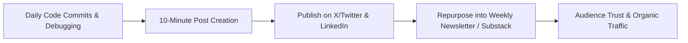

# The Build in Public Content Playbook & Publishing Framework

> **A first-principles operational manual for content creation, post templates, screenshot design, and cross-platform publishing workflows for software makers.**

---

## 📌 Executive Summary

For developer-founders, content creation is not about writing artificial marketing copy—it is about documenting your real-world engineering process. By treating development activities (debugging, refactoring, milestone wins, and server crashes) as raw content input, you build an authentic audience while shipping code.



---

## 1. Content Generation Matrix

Building software takes time, but creating content shouldn't consume your entire day. Use this matrix to map engineering activities to high-engagement social posts in under 10 minutes:

```text
┌───────────────────────────┬───────────────────────────┬───────────────────────────┐
│ Engineering Activity      │ Content Format            │ Post Hook Example         │
├───────────────────────────┼───────────────────────────┼───────────────────────────┤
│ Fixed a complex bug       │ Technical Micro-Post      │ "Spent 4 hours debugging  │
│                           │                           │ this race condition..."   │
├───────────────────────────┼───────────────────────────┼───────────────────────────┤
│ Redesigned a UI view      │ Visual Before/After       │ "Old UI vs New UI. Which  │
│                           │                           │ one do you prefer?"       │
├───────────────────────────┼───────────────────────────┼───────────────────────────┤
│ Hit revenue milestone     │ Transparency Metrics      │ "Just hit $500 MRR! Here  │
│                           │                           │ is what worked..."        │
├───────────────────────────┼───────────────────────────┼───────────────────────────┤
│ Faced a major outage      │ Post-Mortem Reflection    │ "Our server crashed today.│
│                           │                           │ Here is what broke..."    │
└───────────────────────────┴───────────────────────────┴───────────────────────────┘
```

---

## 2. 4 High-Converting Social Post Templates

### Template A: The Technical Challenge & Solution
```text
Overcame a tough engineering bottleneck today 🛠️

Problem: [Describe technical hurdle in plain language]
Why it mattered: [Explain impact on user experience or performance]
Solution: [Describe how you solved it in 2-3 bullet points]

Key takeaway for builders: [1-sentence lesson]

#buildinpublic #indiehacker #webdev
```

### Template B: The Feature Preview Poll
```text
Working on a new feature for [Product Name] 🚀

Option A: [Describe Approach A with screenshot/mockup]
Option B: [Describe Approach B with screenshot/mockup]

Which workflow would save you more time in your daily routine? 

Drop your thoughts below! 👇
```

### Template C: The Milestone & Lessons Retrospective
```text
🎉 [Product Name] just crossed [Milestone: e.g., 500 users / $1,000 MRR]!

Here are the 3 biggest decisions that drove this growth:
1. [Insight 1]
2. [Insight 2]
3. [Insight 3]

Biggest mistake we made along the way: [Share 1 honest failure]

Thank you to everyone following the journey! ❤️
```

### Template D: The Fail-Forward Post-Mortem
```text
We made a mistake today, and I want to be 100% transparent about it.

What happened: [Describe incident or wrong product decision]
The impact: [Number of users affected or lost revenue]
What we did immediately: [Mitigation steps taken]
How we are preventing it in the future: [Long-term fix]

Building in public means owning the lows alongside the wins. Lessons learned! 💪
```

---

## 3. Visual Assets & Screenshot Best Practices

1. **High Contrast UI Shots**: Use clean, modern backgrounds (e.g., subtle gradients or dark mode frames) to highlight software interface screenshots.
2. **Annotated Diagrams**: Use flowcharts or clean arrows to explain data flows or user steps directly on images.
3. **Clean Code Snippets**: Format code snippets cleanly with syntax highlighting using tools like Carbon or Ray.so.

---

## 4. Cross-Platform Publishing Workflow

```text
┌───────────────────────────────────────────────────────────────────────────┐
│                     THE 30-MINUTE WEEKLY CONTENT WORKFLOW                 │
└───────────────────────────────────────────────────────────────────────────┘
   Step 1: Document daily notes during code commits (2 mins/day)
         │
         ▼
   Step 2: Draft 3 micro-posts on X & Threads (15 mins on Monday)
         │
         ▼
   Step 3: Expand top-performing micro-post into a LinkedIn article (10 mins)
         │
         ▼
   Step 4: Compile weekly logs into a monthly Substack newsletter (15 mins)
```

---

## 5. Summary

Consistency beats intensity. By embedding lightweight content capture into your regular coding workflow, you can maintain an active public presence without sacrificing engineering momentum.
