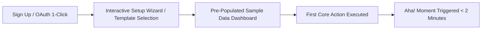

# Customer Onboarding, Time-to-Value (TTV) & Activation Mechanics

> **A first-principles guide to minimizing Time-to-Value (TTV), engineering user activation "Aha!" moments, designing zero-friction onboarding flows, and building automated lifecycle sequences.**

---

## 📌 Executive Summary

Acquiring a user means nothing if they drop off before experiencing your product's value. **Time-to-Value (TTV)** measures the exact elapsed time between signup and the user's first **"Aha!" Moment**. In modern SaaS, every unnecessary form field, email confirmation wall, or blank empty state reduces onboarding conversion exponentially.



---

## 1. Defining & Measuring Activation "Aha!" Moments

An **Activation Event** is the specific action or threshold that predicts 30-day user retention.

$$\text{Activation Rate \%} = \frac{\text{Users Who Reach "Aha!" Milestone in < 48 Hours}}{\text{Total New Signups}} \times 100$$

> **The 48-Hour Onboarding Law**: Users who do not achieve their "Aha!" moment within 48 hours of signup have a **> 85% probability of permanent churn**.

### Iconic Activation Benchmarks

| Product | Activation "Aha!" Benchmark | Why It Works |
| :--- | :--- | :--- |
| **Slack** | Team sends 2,000 internal messages. | Network effect locked in; habits established. |
| **Dropbox** | User drops 1 file into folder on 1 device. | Instant realization of cross-device sync. |
| **Plausible Analytics** | User pastes 1 script tag & sees first live hit. | Real-time visual feedback under 60 seconds. |
| **Canva** | User exports or downloads their first graphic. | End-to-end task completion achieved. |

---

## 2. Onboarding Friction Reduction Protocol

```text
┌───────────────────────────────────────────────────────────────────────────┐
│                      FRICTION REDUCTION PROTOCOL                          │
└───────────────────────────────────────────────────────────────────────────┘
   BEFORE (High Friction)                 AFTER (Zero Friction)
   ❌ Complex Password Rules      ──►  ✅ Google OAuth / Magic Links
   ❌ Mandatory Credit Card Upfront──►  ✅ 14-Day Free Trial (No Card Needed)
   ❌ 15-Question Survey Form    ──►  ✅ 1-Click Persona Template
   ❌ Blank White Dashboard       ──►  ✅ Pre-populated Sample Data
```

---

## 3. The 3 Golden UI Onboarding Patterns

### Pattern 1: Pre-Populated Sample Data
Never show a blank table or zero-state chart. Fill empty dashboards with sample projects (e.g., *"Sample E-Commerce Store"*) marked with clear badges. Allow users to edit or delete sample data in 1 click.

### Pattern 2: Progressive Disclosure
Never overwhelm new users with 50 settings menus. Show only the **1 primary action** required for step 1. Reveal advanced configuration options only after the primary task is completed.

### Pattern 3: Interactive Checklist Widget
Embed a persistent 4-step progress widget on the dashboard:
```text
┌──────────────────────────────────────────────┐
│ YOUR QUICK START (2/4 COMPLETED)             │
│ [✓] Create your account                      │
│ [✓] Select a project template                │
│ [ ] Invite 1 teammate (Unlock +100 Credits)   │
│ [ ] Deploy your first live endpoint          │
└──────────────────────────────────────────────┘
```

---

## 4. The 5-Day Automated Lifecycle Activation Email Sequence

If a user signs up but stalls before activation, trigger an automated event-driven email flow:

```mermaid
flowchart TD
    A[Signup Event] --> B{Did user hit Activation Event in 2 hours?}
    B -->|Yes| C[Send Advanced Power-User Tips Email]
    B -->|No| D[Day 1: "Need help getting started?" Personal Founder Email]
    D --> E[Day 3: 60-Second Video Demo of Core Feature]
    E --> F[Day 5: Invite to 1-on-1 Founder Onboarding Call]
```

### Day 1 Plain-Text Founder Email Template:
```text
Subject: Quick question about [Product]

Hi [Name],

I saw you signed up for [Product] earlier today—thank you! 

I noticed you haven't created your first [core asset] yet. Did you run into any issues during setup, or is there a specific integration you're waiting for?

Hit reply and let me know. I read and respond to every email personally!

[Founder Name]
Developer @ [Product]
```

---

## 5. Summary

Onboarding is the most leveraged growth bottleneck in software. By eliminating sign-up friction, pre-populating empty states, driving users to their "Aha!" moment in under 2 minutes, and deploying event-driven lifecycle emails, you maximize trial-to-paid conversion.

