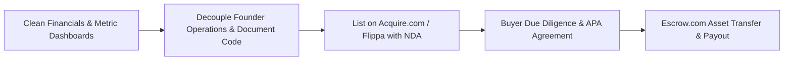
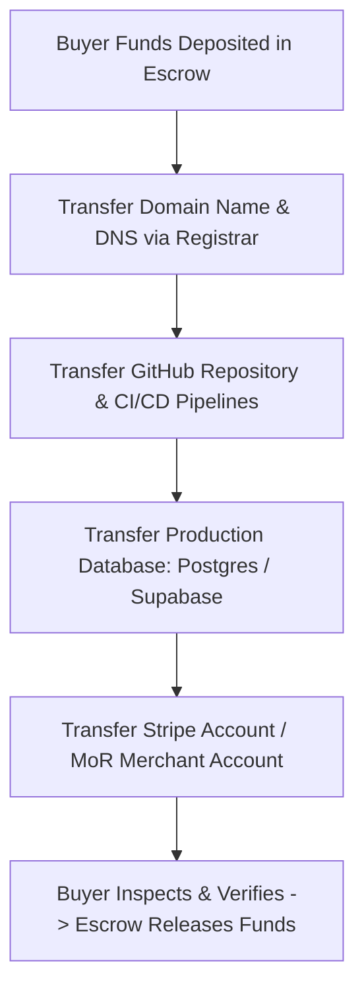

# Micro-Acquisitions & Exiting an Indie SaaS

> **A strategic engineering and financial guide to preparing, valuing, listing, negotiating, and successfully exiting a Micro-SaaS business.**

---

## 📌 Executive Summary

Exiting (selling) a Micro-SaaS provides immediate life-changing liquidity, mitigates long-term product burnout risk, and unlocks capital to fund your next venture. The micro-acquisition market ($10k to $1M+) has exploded for bootstrapped creators. Building your product with an exit mindset forces clean documentation, automated deployments, and decoupled operations.



---

## 1. Micro-SaaS Valuation Frameworks

Micro-SaaS businesses are valued as a multiple of **Seller's Discretionary Earnings (SDE)** or **Annual Recurring Revenue (ARR)**.

$$\text{SDE} = \text{Net Revenue} - \text{Cost of Goods Sold (COGS)} - \text{Operating Expenses} + \text{Founder Salary/Perks}$$

$$\text{Business Valuation} = \text{Annual SDE or ARR} \times \text{Valuation Multiple}$$

### Valuation Multiple Benchmarks

| Product Profile | YoY Growth Rate | Monthly Churn % | Multiple Range | Example ($50k SDE) |
| :--- | :--- | :--- | :--- | :--- |
| **High Maintenance / Declining** | $< 0\%$ | $> 6\%$ | **1.5x – 2.5x SDE** | $\$75,000 – \$125,000$ |
| **Steady Bootstrapped SaaS** | $10\% - 30\%$ | $2\% - 4\%$ | **3.0x – 4.5x SDE** | **$150,000 – $225,000** |
| **Hypergrowth / Low Churn** | $> 50\%$ | $< 2\%$ | **5.0x – 7.0x+ ARR** | **$250,000 – $350,000+** |

---

## 2. Factors That Boost vs. Lower Your Valuation

```text
┌───────────────────────────────────────────────────────────────────────────┐
│                      VALUATION MULTIPLE BOOSTERS                          │
└───────────────────────────────────────────────────────────────────────────┘
   ▲ Low Churn (<2%):         Proves strong product utility & retention.
   ▲ Clean Automated Code:    Zero technical debt; easy for buyer to maintain.
   ▲ Organic Inbound Traffic: High pSEO / BiP brand traffic; $0 ad dependency.
   ▲ Standard Tech Stack:     Go, Node, React, Postgres (Easier to find devs).
```

- **Valuation Killers**: Single customer concentration (>30% revenue from 1 client), messy personal/business expense mixing, un-documented spaghetti code, reliance on proprietary founder social accounts for 100% of sales.

---

## 3. The 6-Step Asset Transfer Protocol

When an Asset Purchase Agreement (APA) is signed, execute asset migration via **Escrow.com** or **Acquire Escrow**:



1. **Domain Name**: Unlock and initiate auth code transfer via Namecheap/Cloudflare.
2. **Source Code**: Transfer ownership of GitHub/GitLab organizations.
3. **Database**: Export and transfer PostgreSQL / Supabase project ownership.
4. **Payment Gateway**: Execute Stripe Account Ownership Transfer or migrate billing tokens.
5. **Infrastructure**: Transfer AWS, Hetzner, Vercel, or Docker VPS accounts.
6. **Support Channels**: Hand over Crisp/Intercom chat or support email inboxes.

---

## 4. Post-Acquisition Transition & Handover

Include a **14 to 30-day transition support clause** in your APA:
- Provide 10–20 hours of asynchronous support via Slack or Loom videos explaining codebase architecture and deployment commands.
- Sign standard non-compete agreements (typically 2–3 years restriction on building a direct clone in the same niche).

---

## 5. Summary

Building to sell forces you to build an automated, clean, and sustainable business. Whether you choose to hold long-term or cash out, operating with an acquisition mindset maximizes the true economic value of your software.

