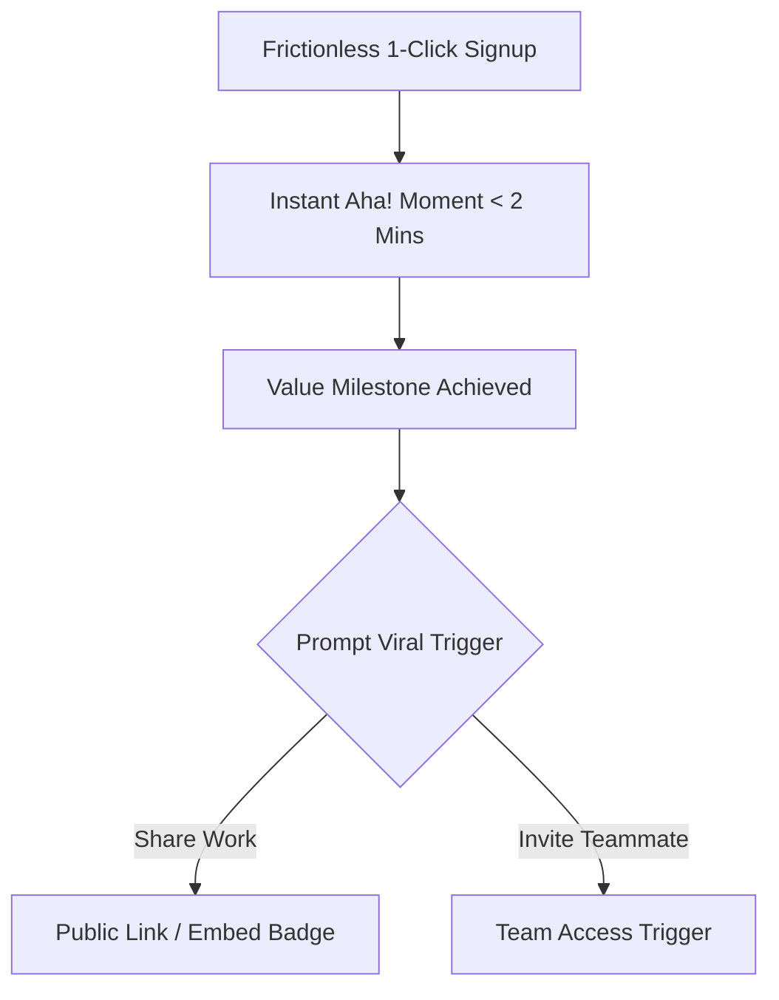

# Growth Loops & Viral Distribution Engines for Indie Products

> **A first-principles guide to replacing traditional linear marketing funnels with compounding growth loops, viral K-factor mechanics, and Product-Led Growth (PLG).**

---

## 📌 Executive Summary

Traditional marketing operates as a **linear funnel**: you spend money or time driving traffic, a small percentage converts, and the rest is lost. A **Growth Loop** is a closed, compounding system where the action of an existing user naturally recruits or exposes the product to new users.


---

## 1. The Math of Virality: The K-Factor Formula

The viral potential of a software product is measured by the **K-Factor** (Viral Coefficient):

$$K = i \times c$$

- **$i$ (Invites Sent)**: Average number of invitations or share links generated per active user.
- **$c$ (Conversion %)**: Percentage of recipients who click and sign up for the product.

```text
┌───────────────────────────────────────────────────────────────────────────┐
│                        K-FACTOR THRESHOLD MATRIX                          │
└───────────────────────────────────────────────────────────────────────────┘
   K > 1.0  ──► Exponential Viral Growth (Product grows automatically!)
   K = 1.0  ──► Linear Growth (Every user replaces themselves)
   K < 1.0  ──► Sub-Viral Growth (Loops assist marketing, but won't sustain alone)
```

*Example*: If every user invites 5 teammates ($i = 5$) and 25% accept ($c = 0.25$), then $K = 5 \times 0.25 = 1.25$ (**Exponential Viral Explosion!**).

---

## 2. The 4 Core Growth Loop Architectures

| Loop Type | Mechanism | Real-World Example | Solo Builder Fit |
| :--- | :--- | :--- | :--- |
| **1. Collaborative Loop** | Product utility requires inviting team members or clients. | Slack, Figma, Cal.com, Documenso. | ⭐⭐⭐⭐⭐ (Highest conversion) |
| **2. Content Output Loop** | Users export or share work created in the app. | Loom videos, Notion public pages, Typeform surveys. | ⭐⭐⭐⭐⭐ (Free branding) |
| **3. Financial Incentive Loop** | Users earn product credits by inviting peers. | Dropbox (500MB free per invite), Wise referral bonus. | ⭐⭐⭐ (Requires reward budget) |
| **4. User-Generated SEO Loop** | User activity generates indexable public pages. | StackOverflow, Reddit, Product Hunt, GitHub. | ⭐⭐⭐⭐ (High long-tail traffic) |

---

## 3. Product-Led Growth (PLG) Onboarding Architecture



### The 3 Rules of High-Converting PLG Triggers
1. **Never Prompt for Invites at Onboarding**: Users haven't experienced value yet. Prompt for invitations *immediately after* a success milestone (e.g., after publishing a site or finishing a workflow).
2. **Powered-By Branding Badge**: On free tiers, include a subtle, high-converting *"Powered by [Product]"* badge linking back to your landing page.
3. **Frictionless Recipient Experience**: When an invited peer clicks a link, allow them to view or interact *before* forcing account creation.

---

## 4. Viral Loop Audit Checklist

```text
┌───────────────────────────────────────────────────────────────────────────┐
│                      VIRAL GROWTH LOOP CHECKLIST                          │
└───────────────────────────────────────────────────────────────────────────┘
   [ ] 1. Does the core workflow produce a shareable public artifact (URL/PDF)?
   [ ] 2. Is there a "Powered by [Product]" link on exported assets?
   [ ] 3. Can recipient users experience value without logging in?
   [ ] 4. Are invite buttons visible during key success moments?
   [ ] 5. Is there a 1-click social share trigger after feature completion?
```

---

## 5. Summary

Growth loops transform your product into its own primary marketing engine. By embedding collaborative workflows, public content assets, and frictionless recipient onboarding, indie products compound users organically without relying on ad spend.

