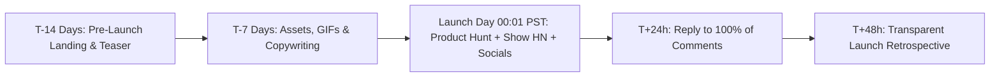

# The Indie Hacker Product Launch & Distribution Playbook

> **A first-principles tactical playbook for orchestrating high-impact launches across Product Hunt, Hacker News, Reddit, and Social Media.**

---

## 📌 Executive Summary

A launch is not a single 24-hour event—it is an orchestrated distribution engine. Winning launches are built on pre-launch audience momentum, transparent storytelling, and rapid post-launch feedback loops. This guide outlines the exact schedules, templates, and channel rules to maximize reach without paying for ads.



---

## 1. The 14-Day Pre-Launch Execution Timeline

```text
┌───────────────────────────────────────────────────────────────────────────┐
│                      THE 14-DAY LAUNCH EXECUTION TIMELINE                 │
└───────────────────────────────────────────────────────────────────────────┘
   T-14 Days: Build 1-page teaser & waitlist landing page.
   T-10 Days: Tease core workflow GIFs on X/Twitter and LinkedIn.
   T-7  Days: Prepare PH graphics (1270x760 GIF) & Maker First Comment.
   T-3  Days: Load test infrastructure & verify Stripe webhook handlers.
   T-1  Day : Schedule launch post at 00:01 PST (14:01 PM Vietnam Time).
   LAUNCH   : Go live, broadcast to email list & reply to all comments in <15 mins.
```

---

## 2. Product Hunt Execution Playbook

Product Hunt operates on a 24-hour daily cycle resetting at **00:01 AM PST** (14:01 PM Vietnam Time).

### A. Asset & Copywriting Checklist
- **Product Name**: Clean title without buzzwords.
- **Tagline (Max 60 chars)**: State the exact user benefit.
  - *Good*: *"Automate PostgreSQL backups to S3 in 60 seconds."*
  - *Bad*: *"The best revolutionary AI tool for developers."*
- **Thumbnail**: Animated GIF (240x240px or 1270x760px) showing the core product UI in action.
- **Gallery**: 5–7 high-res screenshots (1270x760px) demonstrating key features.

### B. The Maker First Comment Template
```text
Hey Product Hunt! 👋

I'm [Founder Name], an independent developer building from Da Nang. 

Over the past year, I got frustrated by [Specific Pain Point]. Existing tools were either overly expensive ($200/mo) or clunky enterprise software.

So I built [Product Name]: a lightweight, fast, and simple solution that solves [Pain Point] in under 2 minutes.

✨ Key Features:
- Feature 1: Description
- Feature 2: Description
- Feature 3: Description

🎁 PH Community Deal: Get 20% off forever using code PHLAUNCH at checkout!

I'd love to get your feedback and answer any technical questions about our architecture!
```

---

## 3. Hacker News "Show HN" Masterclass

Hacker News users despise marketing fluff and corporate speak. They value technical transparency, architecture decisions, and performance benchmarks.

### A. Title Formulas
- *Format*: `Show HN: Product Name – Technical description of what it does`
- *Example*: `Show HN: Kitwork – A zero-dependency Go web runtime with custom VM`

### B. The 3 Commandments of Show HN
1. **Never ask for upvotes**: HN's anti-gaming algorithm will instantly shadowban your post.
2. **Be ready for technical criticism**: Embrace harsh critique with humility and technical depth.
3. **Include a live demo link without login gates**: Allow HN users to try the product in 1 click.

---

## 4. Reddit Value-First Storytelling Strategy

Subreddits like `r/SideProject`, `r/IndieHackers`, `r/SaaS`, and `r/webdev` can generate thousands of high-intent visitors if you follow the **Value-First Rule**.

### The 80/20 Post Structure
- **80% Story & Technical Lessons**: Share what broke during development, initial failed attempts, memory usage numbers, or founder lessons.
- **20% Subtle Product Link**: Include the link naturally at the end as an open-source or indie project showcase.

---

## 5. Post-Launch 48-Hour Retrospective

Within 48 hours of launch, write and publish a transparent **Launch Retrospective**:

```text
┌───────────────────────────────────────────────────────────────────────────┐
│                      THE 48-HOUR RETROSPECTIVE MATRIX                     │
└───────────────────────────────────────────────────────────────────────────┘
   1. Traffic Metrics:     Unique visitors, top referral sources (PH vs HN vs Reddit).
   2. Conversion Data:     Total signups, paid conversions, MRR generated.
   3. Server Telemetry:    Peak CPU, memory footprint, unexpected bugs/outages.
   4. Top Feature Requests: Top 3 items users asked for during launch day.
```

---

## 6. Summary

A successful launch is about authentic engagement. By preparing assets 14 days in advance, respecting the unique culture of each platform (PH vs HN vs Reddit), and publishing honest retrospectives, you turn launch day into compounding distribution.


