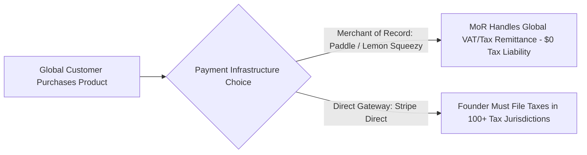

# Legal, Tax & Compliance for Global Indie Founders

> **A first-principles legal, tax, and compliance guide for independent software developers operating global digital products and SaaS businesses.**

---

## 📌 Executive Summary

Building software globally means interacting with international tax laws, privacy regulations (GDPR/CCPA), and business liability. For solo builders, legal compliance is not about hiring expensive law firms—it is about choosing the right merchant structure (Merchant of Record vs Direct Stripe), displaying standard legal agreements, and insulating personal assets.



---

## 1. Merchant of Record (MoR) vs. Direct Payment Processor

Selling digital software subjects your business to local Value Added Tax (VAT) and Sales Tax in over 100 countries—even without a physical office there.

| Feature / Metric | Direct Processor (Stripe Direct) | Merchant of Record (Paddle / LemonSqueezy) |
| :--- | :--- | :--- |
| **Transaction Fee** | $2.9\% + \$0.30$ | $5\% + \$0.50$ |
| **Global Tax Remittance** | Founder must manually register & file taxes in EU, UK, US, etc. | **MoR automatically calculates, collects, and remits 100% of global taxes.** |
| **Legal Merchant** | Your company is the merchant on customer bank statements. | The MoR acts as the legal reseller of your software. |
| **Chargeback Risk** | You handle chargeback disputes directly. | MoR manages chargeback disputes & fraud protection. |
| **Best For** | Experienced teams with dedicated tax accountants. | **Solo Indie Hackers & Bootstrappers (Recommended)** |

---

## 2. Global Incorporation Frameworks for Non-US/Global Founders

Registering a formal business entity insulates founders from personal financial liability and grants access to global banking (Mercury, Wise Business).

```text
┌───────────────────────────────────────────────────────────────────────────┐
│                      GLOBAL INCORPORATION COMPARISON                      │
└───────────────────────────────────────────────────────────────────────────┘
   US Delaware LLC   ──► Turnkey via Stripe Atlas / Firstbase. Low maintenance.
   Singapore Pte Ltd ──► Excellent for Asia-Pacific founders; tax friendly.
   Local Entity      ──► Simplest for local banking, but harder for global Stripe.
```

---

## 3. Essential Developer Legal Agreements Checklist

Every commercial software app must link to 3 primary legal documents in its footer:

1. **Terms of Service (ToS)**:
   - **Limitation of Liability**: Limit damages to the maximum of amounts paid by user in the last 12 months.
   - **Acceptable Use Policy**: Prohibit reverse engineering, spam, or service abuse.
   - **Class Action Waiver**: Require binding individual arbitration.
2. **Privacy Policy**: Explicitly detail what data is collected (emails, IP addresses, payment logs) and third-party APIs used (Stripe, Vercel, Supabase).
3. **Refund & Cancellation Policy**: Clearly define refund windows (e.g., *"14-day money-back guarantee"*).

---

## 4. GDPR & CCPA Developer Compliance Protocol

```text
┌───────────────────────────────────────────────────────────────────────────┐
│                     GDPR DEVELOPER COMPLIANCE CHECKLIST                   │
└───────────────────────────────────────────────────────────────────────────┘
   [ ] 1. Privacy-First Analytics: Use cookie-free tools (Plausible / Umami).
   [ ] 2. Data Deletion API: Build a 1-click "Delete Account & Data" endpoint.
   [ ] 3. Data Export API: Provide JSON export of user-generated data.
   [ ] 4. Explicit Opt-in: Require active checkbox for marketing email updates.
```

---

## 5. Summary

Addressing legal and compliance requirements early prevents devastating financial penalties. By utilizing a Merchant of Record, implementing privacy-first analytics, and publishing standard legal agreements, you operate a resilient global software business.

