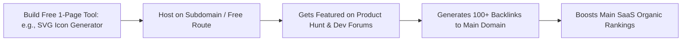

# Programmatic SEO & Organic Growth for Indie SaaS

> **A first-principles engineering guide to Programmatic SEO (pSEO), long-tail keyword data pipelines, competitor alternative landing pages, and engineering-as-marketing distribution engines.**

---

## 📌 Executive Summary

**Programmatic SEO (pSEO)** is an engineering-driven distribution strategy that generates hundreds of high-quality, dynamically rendered landing pages targeting long-tail search intent. Rather than writing manual blog posts, pSEO combines structured datasets, static site generators, and programmatic routes to capture low-competition, high-conversion organic traffic.

```mermaid
flowchart TD
    A[Structured Dataset: CSV / JSON / SQL] --> B[Dynamic Route Generator: /vs/[competitor]]
    B --> C[Page Template with JSON-LD Schema]
    C --> D[Build-Time Static Page Generation]
    D --> E[XML Sitemap Submission -> Google Search Console]
    E --> F[High-Intent Organic Inbound Traffic]
```

---

## 1. The pSEO Data Pipeline Architecture

```text
┌───────────────────────────────────────────────────────────────────────────┐
│                       THE 3-PART PSEO EQUATION                            │
└───────────────────────────────────────────────────────────────────────────┘
   [ Head Term ]   +   [ Dynamic Modifier ]   =   [ Long-Tail Keyword Page ]
   "Invoice Generator" + "for Freelancers in [Country]" = "/invoices/[country]"
```

### The Long-Tail Pattern Matrix

| Pattern Type | URL Structure Example | Target Intent | Conversion Rate |
| :--- | :--- | :--- | :--- |
| **Competitor Alternative** | `/alternative-to/[competitor]` | High intent: Users actively switching. | ⭐⭐⭐⭐⭐ (Highest) |
| **Use-Case / Industry** | `/[product]-for-[industry]` | Targeted interest (e.g., *"for Dentists"*). | ⭐⭐⭐⭐ |
| **Integration / Tech Stack** | `/integrations/[service]` | Technical search (e.g., *"PostgreSQL backup to S3"*). | ⭐⭐⭐⭐ |
| **Free Tool / Calculator** | `/tools/[calculator-name]` | High volume top-of-funnel traffic. | ⭐⭐⭐ |

---

## 2. Technical Implementation & Schema.org JSON-LD

To achieve 100 PageSpeed scores and instant Google indexing, generate static pages at build time with structured microdata.

### Dynamic Route & SEO Meta Code Pattern

```javascript
// Next.js / Kitwork Static pSEO Route Pattern
export async function generateMetadata({ params }) {
  const data = await getDatasetItem(params.slug);
  
  return {
    title: `${data.name} Alternative: Why 500+ Teams Switched to [Product]`,
    description: `Compare ${data.name} vs [Product]. See feature differences, pricing comparison, and 1-click migration tools.`,
    openGraph: {
      title: `${data.name} vs [Product] Full Comparison`,
      images: [`/api/og?name=${data.name}`],
    },
  };
}
```

### Essential JSON-LD Microdata snippet:
Always include `SoftwareApplication` and `FAQPage` Schema.org microdata in your HTML `<head>` to secure rich snippets in Google search results.

---

## 3. "Competitor Alternative" Page Formula

Pages targeting `"Best [Competitor] Alternative"` convert higher than almost any other channel.

```text
┌───────────────────────────────────────────────────────────────────────────┐
│                 HIGH-CONVERTING ALTERNATIVE PAGE STRUCTURE                 │
└───────────────────────────────────────────────────────────────────────────┘
   1. H1 Headline:        "The Privacy-First Alternative to [Competitor]"
   2. Feature Comparison: 1-to-1 comparison table highlighting your strengths.
   3. Price Contrast:     Show clear savings (e.g., "$29/mo flat vs $200/mo seat tier").
   4. Migration Tool:     Offer a 1-click CSV import from their old service.
   5. Risk Reversal CTA:  "Try free for 14 days — No credit card required."
```

---

## 4. Engineering-as-Marketing Strategy

Building lightweight, free standalone tools is a proven hack for acquiring high-authority backlinks and domain authority (DR 50+).



---

## 5. High-DR Directory Submission Matrix

Boost your brand domain authority by submitting to trusted startup index directories:

- **Tier 1 (High DR)**: Product Hunt, Hacker News, AlternativeTo, SaaSHub, G2, Capterra.
- **Tier 2 (Niche Indie)**: BetaList, StartupBase, Microns, MicroAcquire, Indie Hackers.
- **Tier 3 (Dev Platforms)**: GitHub Showcase, Dev.to, Hashnode, StackShare.

---

## 6. Summary

Programmatic SEO and engineering-as-marketing transform code into a continuous, compounding customer acquisition engine. By building structured data pipelines, competitor comparison pages, and free micro-tools, you dominate organic search without paying for ads.

