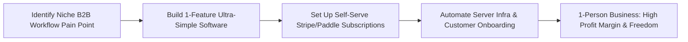

# The Micro-SaaS Playbook: Building 1-Person Subscription Products

> **A first-principles guide to designing, shipping, pricing, and scaling 1-person subscription products with low churn and high profit margins.**

---

## 📌 Executive Summary

A **Micro-SaaS** is a hyper-focused Software-as-a-Service product built to solve a specific problem for a well-defined niche audience. Operated by a single founder (or 2-person team) with near-zero overhead, Micro-SaaS targets **$1,000 to $20,000 in Monthly Recurring Revenue (MRR)**, providing financial independence and complete lifestyle freedom.



---

## 1. What is a Micro-SaaS?

A **Micro-SaaS** is a small, highly focused Software-as-a-Service product built to solve a specific problem for a niche audience. It is typically operated by a **single founder (or a team of 2)** with minimal overhead costs, aiming for **$1,000 to $20,000 in Monthly Recurring Revenue (MRR)**.

```text
┌───────────────────────────────────────────────────────────────────────────┐
│                        THE MICRO-SAAS ARCHITECTURE                        │
└───────────────────────────────────────────────────────────────────────────┘
   Niche Pain Point ──► Single-Feature Solution ──► Automated Onboarding ──► Low Churn
```

---

## 2. Finding & Validating Niche Micro-SaaS Ideas

### Strategy 1: Unbundling Large Platforms
Find complex enterprise software (e.g., Salesforce, Jira, HubSpot) and build a lightweight, 10x simpler tool targeting a specific user sub-segment.

### Strategy 2: Developer & Workflow Integration
Build plugins, Chrome extensions, or API integrations for existing platforms with large user bases (e.g., Shopify Apps, Slack Apps, GitHub Marketplace, Notion Widgets).

### Strategy 3: Automating Manual Repetitive Tasks
Identify painful manual tasks (e.g., invoice generation, PDF conversion, screenshot beautification, social media scheduling) and automate them into a simple web tool.

---

## 3. Micro-SaaS Pricing Strategies

```text
┌───────────────────────────────────────────────────────────────────────────┐
│                      MICRO-SAAS PRICING TIERS                             │
└───────────────────────────────────────────────────────────────────────────┘
  Tier 1: Starter / Hobbyist   ──► $9 – $19 / mo   (Self-serve, basic limits)
  Tier 2: Professional         ──► $29 – $49 / mo  (Core target market, unlimited usage)
  Tier 3: Team / Enterprise    ──► $99 – $199 / mo (Team accounts, priority support)
```

- **Avoid Free Forever Plans**: Offer free trials or freemium limits, but ensure active power users convert to paid subscriptions quickly.
- **Charge Annually Upfront**: Offer 2 months free for annual billing to boost immediate cash flow.

---

## 4. Reducing Churn & Automating Support

- **Automated In-App Onboarding**: Use short interactive tours or video walkthroughs to guide new users to their first "Aha!" moment in under 2 minutes.
- **Cancellation Surveys**: Capture why users churn (pricing, missing feature, no longer needed) to inform product improvements.
- **Zero-Maintenance Tech Stack**: Use battle-tested, managed services (Vercel, Supabase, Stripe) so you spend 90% of your time on product value, not server upkeep.

---

## 5. Summary

Micro-SaaS is the most accessible vehicle for software developers seeking financial independence. By focusing on a narrow niche, charging fairly, and keeping operations automated, a single developer can build a business that provides freedom for life.
