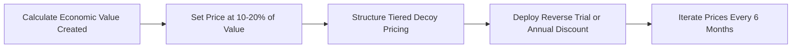
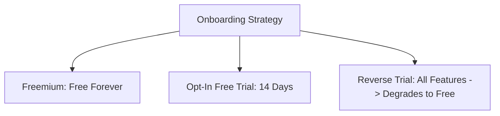

# SaaS & Product Pricing Strategies for Indie Creators

> **A first-principles guide to value-based pricing, subscription mechanics, Decoy Pricing, Van Westendorp sensitivity testing, Reverse Trials, and price increase playbooks for bootstrapped software products.**

---

## 📌 Executive Summary

Pricing is the single most powerful revenue lever in software. Studies by Price Intelligently show that a **1% optimization in pricing yields an 11% increase in operating profit**—making it 4x more effective than acquisition spending. Most developer-founders underprice out of imposter syndrome; this guide provides psychological and quantitative frameworks to capture your true product value.



---

## 1. Value-Based Pricing: The ROI Equation

Never price based on server costs (Cost-Plus) or competitor rates (Race to the Bottom). Price based on the **economic value or time saved** for the customer.

$$\text{Target SaaS Price} \approx 10\% \text{ to } 20\% \text{ of the Net Financial Value Generated}$$

### The Value Equation Matrix

| Product Goal | Economic Metric | Monthly Value Created | 10-20% Value-Based Price |
| :--- | :--- | :--- | :--- |
| **Saves Engineer Time** | 15 hrs/mo saved @ $60/hr | $\$900 / \text{month}$ | **$99 – $149 / month** |
| **Increases Sales Conversion** | 3 extra deals @ $500 margin | $\$1,500 / \text{month}$ | **$149 – $299 / month** |
| **Automates Server Backups** | Prevents $5,000 outage risk | $\$500 \text{ expected value}$ | **$49 / month** |

---

## 2. Decoy Pricing & Tier Structure Mechanics

When offering subscription tiers, use **Decoy Pricing**—a cognitive bias strategy where a middle option is structured to make your recommended target tier appear infinitely higher value.

### The 3-Tier Decoy Architecture

```text
┌───────────────────────────────────────────────────────────────────────────┐
│                       THE 3-TIER DECOY ARCHITECTURE                       │
└───────────────────────────────────────────────────────────────────────────┘
   Tier 1: Starter ($19/mo)  ──► Basic features, tight limits (Anchor)
   Tier 2: Pro ($49/mo)      ──► THE DECOY (Small jump from Starter, limited value)
   Tier 3: Business ($79/mo) ──► RECOMMENDED (Small jump from Pro, UNLIMITED value)
```

| Feature / Limit | Starter ($19/mo) | Pro ($49/mo) — *Decoy* | Business ($79/mo) — *Recommended* |
| :--- | :--- | :--- | :--- |
| **Projects** | 1 Project | 3 Projects | **Unlimited Projects** |
| **Team Seats** | 1 Seat | 2 Seats | **10 Team Seats** |
| **Analytics Retention** | 7 Days | 30 Days | **1 Year Retention** |
| **Support** | Email | Email | **Priority Slack & Email** |

*Psychological Result*: When users compare Pro ($49) vs Business ($79), spending an extra $30 for 10x value feels like an obvious choice, driving 70%+ of users into the highest margin tier.

---

## 3. Van Westendorp Price Sensitivity Meter

To discover the optimal price point without guessing, ask potential users 4 specific questions during interviews or surveys:

```text
┌───────────────────────────────────────────────────────────────────────────┐
│                    VAN WESTENDORP 4-QUESTION SURVEY                       │
└───────────────────────────────────────────────────────────────────────────┘
   1. Too Cheap:   At what price would this product feel so low quality that you'd question it?
   2. Bargain:     At what price would this feel like a great deal / easy buy?
   3. Expensive:   At what price does it start to feel expensive, but you'd still consider it?
   4. Too Pricey:  At what price is it way too expensive to ever consider?
```

- **Point of Marginal Cheapness (PMC)**: Where *Too Cheap* intersects with *Expensive*.
- **Optimal Price Point (OPP)**: Where *Too Pricey* intersects with *Too Cheap*. This is your sweet spot.

---

## 4. Free Trial vs Freemium vs Reverse Trial

Selecting the right trial model directly impacts server expenses and customer acquisition velocity.



| Model | Mechanics | Conversion % | Best Used For |
| :--- | :--- | :--- | :--- |
| **Freemium** | Free forever with strict limits. | $1\% - 3\%$ | Consumer apps, viral developer tools. High server costs! |
| **Traditional Free Trial** | 14-day access to Pro; requires payment after. | $8\% - 15\%$ | B2B SaaS where users can experience value in <7 days. |
| **Reverse Trial** (Recommended) | Users start on full Pro features for 14 days, then degrade to basic Free tier if un-upgraded. | $15\% - 25\%$ | High conversion! Creates loss aversion when Pro features lock. |

---

## 5. Annual Billing & Upfront Cash Flow Optimization

Offer **2 Months Free (or 17–20% discount)** for annual plans:

$$\text{Annual Price} = \text{Monthly Price} \times 10$$

- **Why it matters**: Collect 12 months of upfront cash immediately. This eliminates monthly churn risk for a full year and funds acquisition spending without external funding.

---

## 6. The Price Increase Playbook (Zero Churn Protocol)

Raising prices on existing users is terrifying for founders, but when executed correctly, it produces immediate cash flow surges with minimal churn (< 2%).

### The 4-Step Price Increase Execution Plan

1. **Announce 30 Days in Advance**: Send a transparent, authentic email.
2. **Grandfather Existing Users for 6–12 Months**: Reward early supporters by locking in their current rate temporarily.
3. **Frame Around Value Added**: Highlight major features shipped over the past year.
4. **Give an Urgent Annual Lock-In Option**: Allow users to switch to the old annual price before the increase takes effect.

#### Email Template:
```text
Subject: Upcoming price update for [Product] (and your grandfathered rate)

Hi [Name],

I started [Product] a year ago to help you [core outcome]. Since then, we've shipped [Feature 1], [Feature 2], and improved speed by 3x.

To continue investing in infrastructure and dedicated support, our prices for new users will increase from $29/mo to $49/mo starting next month.

Because you supported [Product] early, your account is grandfathered at $29/mo for the next 12 months. 

Alternatively, if you'd like to lock in $29/mo permanently, you can switch to our annual plan today and get an extra 2 months free.

Thank you for being part of the journey!

[Founder Name]
```

---

## 7. Summary

Pricing is an evolving engine. By moving to value-based pricing, utilizing Decoy tier structures, leveraging Reverse Trials, and periodically grandfathering loyal users through price increases, you unlock healthy, bootstrapped profitability.

