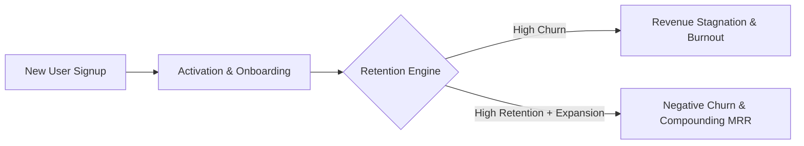

# User Retention & Churn Reduction Frameworks

> **A first-principles guide to measuring user retention, Net Revenue Retention (NRR), involuntary dunning recovery, and voluntary cancellation UX flows.**

---

## 📌 Executive Summary

Acquiring new users into a product with high churn is like pouring water into a leaky bucket. No matter how much marketing budget you spend, high churn places a strict mathematical ceiling on your growth. Sealing retention leaks and achieving **Negative Churn** (where expansion revenue from existing users exceeds churned revenue) is the holy grail of SaaS longevity.



---

## 1. Core Retention Formulas: Churn & NRR

### A. Customer Churn Rate
$$\text{Monthly Churn Rate \%} = \frac{\text{Canceled Customers During Month}}{\text{Total Active Customers at Start of Month}} \times 100$$

### B. Net Revenue Retention (NRR)
**Net Revenue Retention (NRR)** measures the percentage of recurring revenue retained from existing customers over a specific timeframe, factoring in upgrades, downgrades, and cancellations.

$$\text{NRR \%} = \frac{\text{Starting MRR} + \text{Expansion MRR} - \text{Contraction MRR} - \text{Churned MRR}}{\text{Starting MRR}} \times 100$$

```text
┌───────────────────────────────────────────────────────────────────────────┐
│                          NRR HEALTH BENCHMARKS                            │
└───────────────────────────────────────────────────────────────────────────┘
   NRR > 110% ──► Negative Churn (Business grows even with ZERO new signups!)
   NRR = 100% ──► Stable Base (Upgrades perfectly offset churn)
   NRR < 90%  ──► Danger Zone (Leaky bucket; business will eventually stall)
```

---

## 2. Involuntary Churn & Automated Dunning Engine

Involuntary churn (failed credit card payments due to expired cards, bank blocks, or insufficient funds) accounts for **20% to 40% of all SaaS customer churn**.

```mermaid
flowchart TD
    A[Stripe Payment Fails] --> B[Trigger 1: Automatic Smart Retry Rule via Stripe/Paddle]
    B --> C[Trigger 2: In-App Banner "Update Payment Method"]
    C --> D[Trigger 3: Automated 3-Part Dunning Email Sequence]
    D --> E[Payment Recovered - $0 Churn!]
```

### The 3-Part Dunning Email Recovery Sequence

1. **Email 1 (Day 1 - Neutral Alert)**: *"Your invoice payment for [Product] failed. Please update your card."*
2. **Email 2 (Day 3 - Value Reminder)**: *"We couldn't process your payment. Update your card to keep access to your [Key Project/Data]."*
3. **Email 3 (Day 7 - Account Suspension Notice)**: *"Final notice: Account access will be paused in 24 hours."*

---

## 3. Voluntary Cancellation Flow & Loss Aversion UX

Never make cancellation impossible or hidden—that leads to credit card chargebacks and brand anger. Instead, build an **Interactive Cancellation Flow** leveraging loss aversion and alternative choices.

```text
┌───────────────────────────────────────────────────────────────────────────┐
│                    HIGH-CONVERTING CANCELLATION FLOW                      │
└───────────────────────────────────────────────────────────────────────────┘
   User clicks "Cancel" ──► Show Usage Summary ──► Offer Alternatives ──► Survey
```

### The 4 Alternatives to Full Cancellation

1. **Pause Subscription**: Allow users to pause billing for 30–90 days (great for seasonal projects).
2. **Downgrade Tier**: Offer a lightweight $9/mo tier to preserve project data.
3. **50% Discount for 2 Months**: Give a temporary price reduction to help users through tight financial periods.
4. **Direct Founder Help**: Offer a 1-on-1 setup call with the founder to fix technical roadblocks.

---

## 4. Cohort Retention Heatmaps & Diagnostic Matrix

```text
Cohort       Month 1   Month 2   Month 3   Month 4   Month 5
Jan Cohort   100%      65%       45%       40%       40%  <── Retention Flattens (Healthy)
Feb Cohort   100%      40%       20%       10%        5%  <── Unhealthy Leak (Needs Fix)
```

| Symptom | Root Cause | Fix Strategy |
| :--- | :--- | :--- |
| **Drop-off between Day 0 and Day 1** | Poor onboarding / high TTV. | Pre-populate sample data; simplify signup. |
| **Drop-off after Month 1** | Value wasn't habit-forming. | Implement weekly automated summary digest emails. |
| **Sudden spike in Month 3** | Annual renewal shocks or feature gating. | Send renewal reminders; improve pricing transparency. |

---

## 5. Summary

Retention is the bedrock of software survival. By sealing payment failure leaks with automated dunning rules, implementing smart cancellation alternative flows, and striving for >100% NRR, you turn your customer base into a compounding revenue engine.

