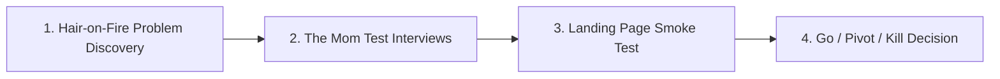

# Zero to One: Ideation, Problem Discovery & Market Validation

> **A first-principles guide to discovering real user problems, conducting unbiased customer interviews, executing landing page smoke tests, and validating market demand before writing code.**

---

## 📌 Executive Summary

Building software before validating market demand is the #1 cause of startup failure. The **Zero to One** phase is not about brainstorming cool features—it is about discovering existing, painful human or business friction and confirming that users are actively searching (and paying) for a solution.



---

## 1. Finding Hair-on-Fire Problems

Great software products eliminate painful friction. Avoid "solutions looking for a problem." Instead, search for **hair-on-fire problems**—issues so urgent that users are currently paying for clunky workarounds, hiring external agencies, or cobbling together fragile spreadsheets.

```text
┌───────────────────────────────────────────────────────────────────────────┐
│                      THE 4-POINT PROBLEM FILTER                           │
└───────────────────────────────────────────────────────────────────────────┘
   1. Is it Painful?       ──► Saves measurable time, money, or emotional distress.
   2. Is it Frequent?      ──► Occurs daily or weekly (high habit potential).
   3. Is it Urgent?        ──► Needs immediate resolution when it happens.
   4. Is there Budget?     ──► Target audience already spends money in this category.
```

### The 3 Problem Categories

| Category | Description | Market Signal | Solo Builder Fit |
| :--- | :--- | :--- | :--- |
| **Hair-on-Fire** | Urgent, costly problem actively breaking workflows. | Users pay immediately; high tolerance for rough MVPs. | ⭐⭐⭐⭐⭐ (Ideal) |
| **Hard Problem** | Technically complex, requires significant R&D. | High moat if solved, but long runway needed. | ⭐⭐ (Requires specialized tech) |
| **Nice-to-Have** | Convenient or entertaining, but non-essential. | Low willingness to pay; high churn; hard to market. | ⭐ (Avoid) |

---

## 2. Customer Interview Validation: The Mom Test Playbook

Created by Rob Fitzpatrick, **The Mom Test** provides rules for talking to potential customers so that even people who love you cannot lie to you about whether your idea is good.

```text
┌───────────────────────────────────────────────────────────────────────────┐
│                          THE MOM TEST CORE RULES                          │
└───────────────────────────────────────────────────────────────────────────┘
   Rule 1: Talk about THEIR life & past actions, NOT your hypothetical idea.
   Rule 2: Ask about SPECIFIC events in the past, NOT opinions about the future.
   Rule 3: Talk LESS (20%) and listen MORE (80%).
```

### Bad Questions vs Good Questions

| Bad Question (Hypothetical & Leading) | Good Question (Behavioral & Past Evidence) | Why It Works |
| :--- | :--- | :--- |
| *"Would you buy an app that automatically cleans your inbox?"* | *"How do you currently manage your inbox? Walk me through yesterday."* | Uncovers real behavior instead of polite promises. |
| *"How much would you pay for a tool like this?"* | *"What tools or services have you paid for in the past 6 months to fix this?"* | Proves historical willingness to spend money. |
| *"Do you think this feature sounds cool?"* | *"When was the last time that issue caused you to miss a deadline?"* | Measures actual pain level and frequency. |

### Detecting & Neutralizing Fake Compliments

When interviewing potential users, people naturally want to be polite. **Fake compliments** (*"That sounds awesome!", "I would definitely use that!"*) are dangerous because they create false validation.

- **How to neutralize a compliment**: Immediately pivot back to past facts.
  - *User*: "That app idea sounds great!"
  - *Founder*: "Thanks! But before I build anything—when was the last time you actually ran into that issue?"
- **How to evaluate feature requests during interviews**: Dig into the underlying pain.
  - *User*: "Can your tool export to PDF?"
  - *Founder*: "Why do you need PDF exports? Who receives those reports and what do they do with them?"

---

## 3. Smoke Testing & Landing Page Pre-Validation

Before writing full software infrastructure, validate market demand using a **Smoke Test**:

```mermaid
flowchart TD
    A[1-Page Value Prop Landing Page] --> B[Targeted Traffic: Ad / Forum / Post]
    B --> C{Call to Action (CTA)}
    C -->|Waitlist Email| D[Measure Sign-Up Conversion %]
    C -->|Pre-Order Deposit| E[Measure Financial Intent]
```

### The 4-Step Smoke Test Execution Plan

1. **Build a Minimal Landing Page**:
   - Clear H1 Headline stating the core outcome (e.g., *"Automate your PostgreSQL backups to S3 in 60 seconds"*).
   - 3 key benefit bullet points.
   - 1 clear Call-to-Action (CTA): *"Join Private Beta"* or *"Pre-Order with 50% Off"*.
2. **Drive 200–500 Targeted Visitors**:
   - Post on niche communities (Show HN, Reddit subreddits, specialized Discord/Slack groups).
   - Run a micro ad campaign ($30–$50 total budget on Google Search or Twitter Ads targeting long-tail keywords).
3. **Analyze Quantitative Benchmarks**:

| Metric | Weak Signal (Pivot/Kill) | Moderate Signal | Strong Signal (Build MVP) |
| :--- | :--- | :--- | :--- |
| **Waitlist Conversion Rate** | $< 5\%$ | $5\% - 15\%$ | $> 20\%$ |
| **Pre-Order Conversion** | $0\%$ | $1\% - 2\%$ | $> 3\%$ |
| **Qualitative Email Replies** | Generic / None | Few questions | Detailed stories & feature requests |

---

## 4. The Go / Pivot / Kill Decision Matrix

Evaluate your discovery data using this objective scoring framework:

```text
┌───────────────────────────────────────────────────────────────────────────┐
│                    IDEATION VALIDATION SCORECARD                          │
└───────────────────────────────────────────────────────────────────────────┘
   [ ] 1. At least 5 interviewees confirmed having the problem in the last 30 days.
   [ ] 2. Interviewees already spend money/time on a partial workaround.
   [ ] 3. Landing page waitlist conversion rate exceeds 15%.
   [ ] 4. Target market is reachable without millions in ad spend.
   [ ] 5. Solution can be shipped as an MVP in under 14 days.
```

- **5 / 5 Checked**: **GO** 🚀 (Proceed immediately to building the MVP).
- **3 – 4 Checked**: **PIVOT** 🔄 (Narrow the target audience or re-frame the core problem).
- **< 3 Checked**: **KILL** ❌ (Abandon the idea; save your time for a better problem).

---

## 5. Summary

Validating ideas before writing code saves months of wasted engineering effort. By searching for hair-on-fire problems, mastering The Mom Test, and measuring real intent via landing page smoke tests, you step into product development with total clarity.

